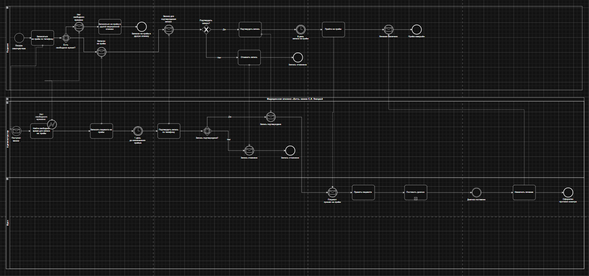
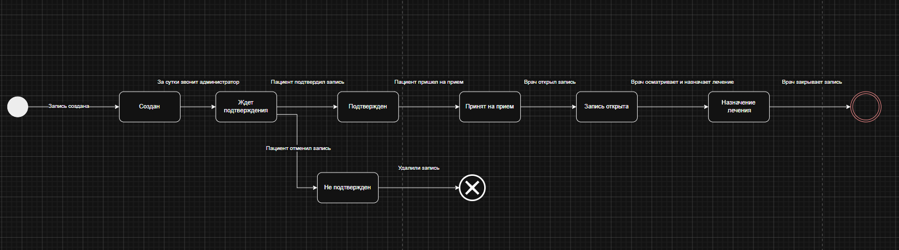
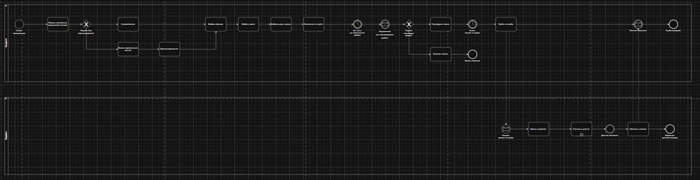

# Анализ и моделирование бизнес-процесса записи пациента на приём в медицинской клинике

## О проекте

Цель проекта — провести анализ текущего процесса записи пациента на приём в сети медицинских клиник «Вита имени Е.Л. Яницкой», определить возможности его автоматизации и спроектировать целевой (TO-BE) бизнес-процесс с использованием мобильного приложения.

В рамках проекта были изучены интервью с ключевыми участниками процесса (пациентом, администратором и врачом), проанализирована существующая схема работы клиники и разработаны модели бизнес-процессов в нотациях BPMN и UML State Machine.

---

# Моя роль — Системный аналитик

В рамках проекта я выполнял следующие задачи:

- анализ предметной области и существующего процесса записи пациентов;
- анализ интервью со стейкхолдерами;
- моделирование текущего бизнес-процесса (AS-IS) в нотации BPMN;
- построение диаграммы состояний процесса записи (UML State Machine);
- выявление ручных операций, подлежащих автоматизации;
- разработка целевого бизнес-процесса (TO-BE) с использованием мобильного приложения;
- подготовка аналитических артефактов для передачи команде разработки.

---

# Постановка задачи

Необходимо было проанализировать существующий процесс записи пациентов на приём, определить его слабые места и предложить вариант автоматизации.

При проектировании целевого процесса необходимо было обеспечить возможность:

- самостоятельной записи пациента через мобильное приложение;
- поиска врача и свободного времени без участия администратора;
- автоматического подтверждения записи;
- сокращения количества ручных операций администратора;
- сохранения существующей логики работы врача и медицинской информационной системы.

---

# Артефакты проекта

## BPMN AS-IS

На основе интервью с пациентом, администратором и врачом была построена модель существующего бизнес-процесса записи на приём.

Диаграмма отражает взаимодействие участников процесса, обмен сообщениями, принятие решений и последовательность выполнения операций до момента завершения приёма.

  

---

## UML State Machine Diagram

На основе результатов интервью была построена диаграмма состояний записи пациента.

Она описывает жизненный цикл записи — от момента создания до завершения приёма либо отмены записи.

Основные состояния процесса:

- Создан;
- Ожидает подтверждения;
- Подтверждён;
- Принят на приём;
- Запись открыта;
- Назначение лечения;
- Не подтверждён;
- Завершён.

  

---

## Анализ процесса

В ходе анализа были выявлены операции, выполняемые вручную и являющиеся узкими местами процесса.

К автоматизации были предложены следующие действия:

- поиск врача;
- поиск свободного времени;
- запись пациента;
- подтверждение записи;
- уведомление пациента;
- отмена записи;
- передача информации между пациентом и клиникой без участия администратора.

---

## BPMN TO-BE

На основании выявленных проблем была разработана целевая модель процесса.

В новой модели пациент самостоятельно:

- авторизуется в приложении;
- выбирает врача;
- выбирает свободный слот;
- записывается на приём;
- получает автоматическое подтверждение записи.

Роль администратора в процессе существенно сокращается, что позволяет уменьшить количество ручных операций и ускорить обслуживание пациентов.

  

---

# Используемые инструменты

- **BPMN 2.0** — моделирование бизнес-процессов;
- **UML State Machine Diagram** — моделирование жизненного цикла записи;
- **draw.io (diagrams.net)** — построение диаграмм;
- анализ интервью со стейкхолдерами;
- Business Process Analysis.

---

# Результат проекта

В результате проекта был подготовлен комплект аналитических артефактов для проектирования новой системы онлайн-записи пациентов:

- анализ текущего бизнес-процесса (AS-IS);
- BPMN-модель существующего процесса;
- UML State Machine Diagram жизненного цикла записи;
- анализ операций, подлежащих автоматизации;
- BPMN-модель целевого процесса (TO-BE);
- рекомендации по автоматизации процесса записи пациентов.

Разработанная TO-BE модель может использоваться в качестве основы для дальнейшего проектирования мобильного приложения, разработки API и реализации функциональности онлайн-записи пациентов.
